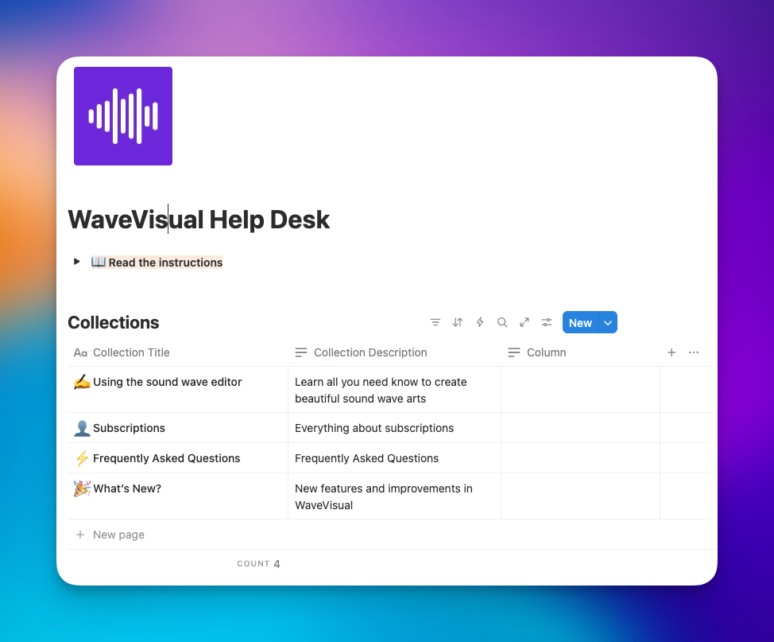
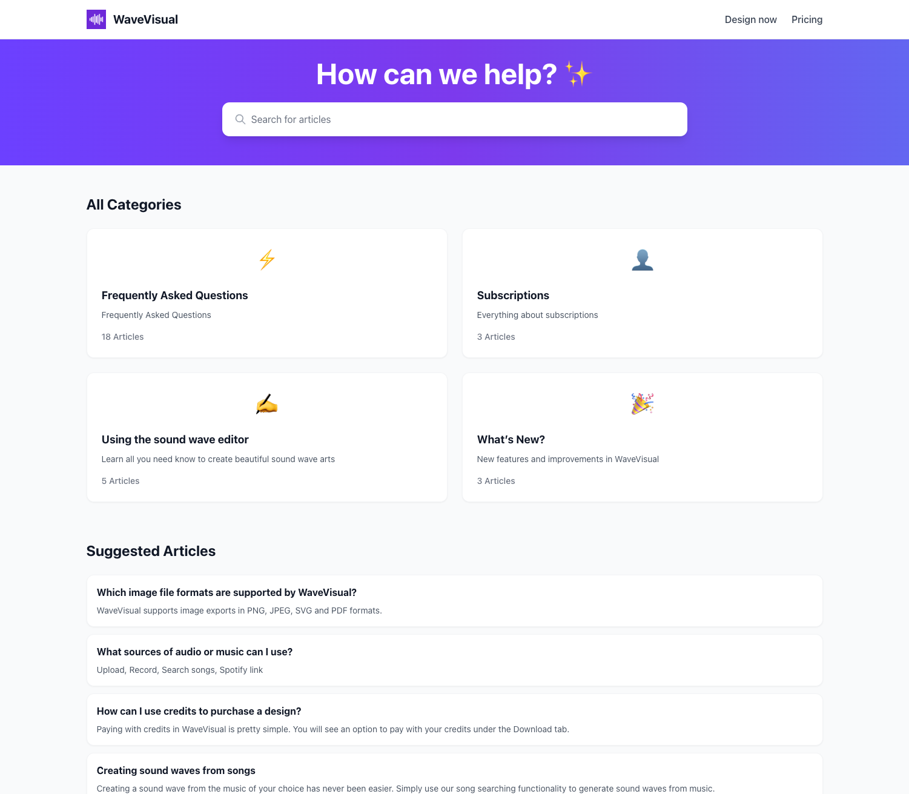

# Notion Help Center

The fastest way to turn your Notion knowledge base into a branded, searchable help center.

Write content in Notion, then publish it on your own domain with a clean docs experience powered by Next.js and SQLite.

Licensed under **Apache-2.0** — see [LICENSE](./LICENSE).

**Live example:** [help.wavevisual.com](https://help.wavevisual.com)

---

## Screenshots

### Notion CMS database (source of truth)



### Published help center experience



---

## Why teams use this

- **Notion-native workflow** — keep writing in Notion where your team already works
- **Customer-ready docs site** — full-text search and structured article pages out of the box
- **Fast setup** — launch quickly with a proven Notion template and straightforward deployment
- **No platform lock-in** — self-hosted, your domain, your data
- **No-code branding controls** — update logo, theme, and navigation in `/admin`

---

## How it works

1. You create and manage help content in a Notion database.
2. The app syncs your collections and articles into SQLite.
3. You deploy a fast help center that your customers can browse and search.

---

## Quickstart with Notion

### 1) Duplicate the Notion template

Duplicate the [HelpKit Knowledge Base Template](https://helpkit.notion.site/HelpKit-Knowledge-Base-Academy-Template-32b504ebbf8a4a31baa2637f1ea24490) into your workspace.  
This is the recommended structure and the same template used by [HelpKit](https://www.helpkit.so).

### 2) Create a Notion integration

- Go to [notion.so/my-integrations](https://www.notion.so/my-integrations)
- Create an integration
- Share your duplicated database with that integration
- Copy the integration token and database ID

### 3) Configure your environment

```bash
cp .env.example .env.local
```

At minimum, set:

```env
NOTION_API_KEY=secret_...
NOTION_DATABASE_ID=...
HELP_CENTER_URL=https://docs.example.com
ADMIN_USERNAME=admin
ADMIN_PASSWORD=your-strong-password
```

### 4) Sync and run

Install [pnpm](https://pnpm.io/installation) (or run `corepack enable` so Node uses the version in `package.json`’s `packageManager` field).

```bash
pnpm install
pnpm run sync
pnpm run dev
```

Open [http://localhost:3000](http://localhost:3000).

For production builds, use:

```bash
pnpm run build:with-sync
pnpm start
```

**Production:** With `NOTION_API_KEY` and `NOTION_DATABASE_ID` on the server, the app registers **node-cron** with **`HELP_CENTER_SYNC_CRON` or, if unset, a default of every six hours (`0 */6 * * *`)**, and runs **one sync right after startup** so you do not need `pnpm run sync` in the build step. Override the interval by setting `HELP_CENTER_SYNC_CRON`. Persist **`/app/data`** (and **`/app/media`**) on a volume so content survives redeploys. See [docs/IMPLEMENTATION.md](./docs/IMPLEMENTATION.md) and [docs/DOCKER.md](./docs/DOCKER.md).

---

## Deploy (Docker)

### 1) Build the image

```bash
docker build -t notion-help-center:latest .
```

### 2) Create env file

```bash
cp .env.example .env.local
```

Make sure `NOTION_API_KEY`, `NOTION_DATABASE_ID`, and `HELP_CENTER_URL` are set.

### 3) Run with persistent volumes

```bash
docker run -p 3000:3000 \
  --env-file .env.local \
  -v notion_help_center_data:/app/data \
  -v notion_help_center_media:/app/media \
  notion-help-center:latest
```

Or use [docker-compose.example.yml](./docker-compose.example.yml).

> **Important:** Mount `/app/data` and `/app/media` as named volumes, not your repo directory. See [docs/DOCKER.md](./docs/DOCKER.md).

---

## Customize without code

With `ADMIN_USERNAME` and `ADMIN_PASSWORD` set, open `/admin` to:

- Upload or link a logo
- Edit brand colors and custom CSS
- Configure navigation links

Settings are stored in SQLite and persist across restarts. See [docs/ADMIN.md](./docs/ADMIN.md).

---

## Technical reference

### Environment variables

| Variable | Required | Description |
|----------|----------|-------------|
| `NOTION_API_KEY` | Yes | Integration token from notion.so/my-integrations |
| `NOTION_DATABASE_ID` | Yes | Root database ID containing your collections |
| `HELP_CENTER_URL` | Yes | Public URL (e.g. `https://docs.example.com`) used for sitemap and absolute links |
| `ADMIN_USERNAME` | Recommended | Enables `/admin` with HTTP Basic auth |
| `ADMIN_PASSWORD` | Recommended | Password for `/admin` |
| `HELP_CENTER_DATA_DIR` | Optional | Override SQLite directory (default: `./data`, or `/app/data` in Docker) |
| `HELP_CENTER_MEDIA_DIR` | Optional | Override media directory (default: `./public/media`, or `/app/media` in Docker) |
| `HELP_CENTER_PUBLIC_DIR` | Optional | Override writable public directory for `site-config.json` (default: `./public`) |
| `NEXT_PUBLIC_CRISP_WEBSITE_ID` | Optional | Crisp chat widget ID for the contact page |
| `NEXT_PUBLIC_FORMSPREE_FORM_ID` | Optional | Formspree form ID for the contact page (used if Crisp is not set) |

See [`.env.example`](./.env.example) for the full template.

### Scripts

| Script | Purpose |
|--------|---------|
| `pnpm run dev` | Next.js dev server |
| `pnpm run build` | Production build |
| `pnpm run build:with-sync` | Sync from Notion, then build (recommended for production) |
| `pnpm run sync` | Fetch Notion to SQLite (dev/manual sync) |
| `pnpm run seed` | Seed sample articles for local demo/testing |
| `pnpm run typecheck` | TypeScript check |

### Local demo mode (for developers)

If you only want to preview the UI locally without connecting Notion:

```bash
pnpm install
pnpm run seed
pnpm run dev
```

---

## Docs

- [docs/DOCKER.md](./docs/DOCKER.md) — volume layout and persistence
- [docs/IMPLEMENTATION.md](./docs/IMPLEMENTATION.md) — architecture and sync flow
- [docs/ADMIN.md](./docs/ADMIN.md) — admin behavior and credentials

---

## Credits

Inspired by [HelpKit](https://www.helpkit.so), a hosted help center solution built on Notion.

---

## Contributing

Issues and PRs are welcome. Use **pnpm** for installs and scripts (`pnpm install`, `pnpm run …`). Do not commit secrets, `package-lock.json`, or deployment-specific branding in shared defaults.
