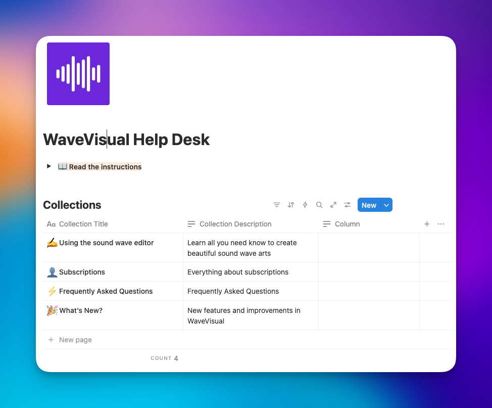
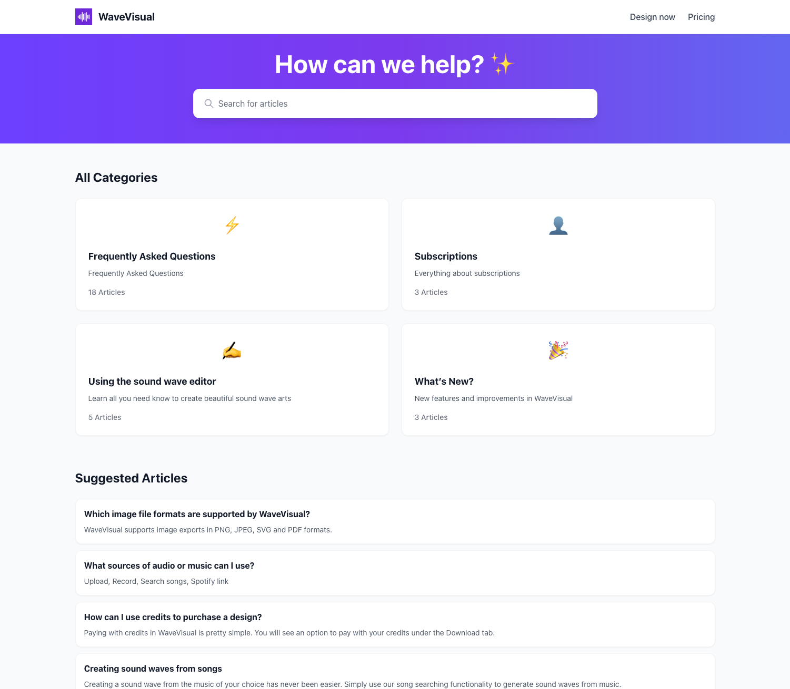

# Notion Help Center

The fastest way to turn your Notion knowledge base into a branded, searchable help center.

Write content in Notion, then publish it on your own domain with a clean docs experience powered by Next.js and SQLite.

Licensed under **Apache-2.0** — see [LICENSE](./LICENSE).

**Live example:** [help.wavevisual.com](https://help.wavevisual.com)

---

## Screenshots

### Notion CMS database (source of truth)



### Published help center experience



---

## Why teams use this

- **Notion-native workflow** — keep writing in Notion where your team already works
- **Customer-ready docs site** — full-text search and structured article pages out of the box
- **Fast setup** — launch quickly with a proven Notion template and straightforward deployment
- **No platform lock-in** — self-hosted, your domain, your data
- **No-code branding controls** — update logo, theme, and navigation in `/admin`

---

## How it works

1. You create and manage help content in a Notion database.
2. The app syncs your collections and articles into SQLite.
3. You deploy a fast help center that your customers can browse and search.

---

## Prerequisites

- **Node.js 20.x, 22.x, 24.x, or 25.x.** This project uses `better-sqlite3`, a native module that does **not** build on Node 18 or 21. On an unsupported version `pnpm install` fails while compiling it.
- **pnpm** — install it directly, or run `corepack enable` so Node uses the version pinned in `package.json`.
- A **Notion account** (for the sync path). To preview the UI without Notion, skip to [Local demo mode](#local-demo-mode-for-developers).

---

## Quickstart with Notion

### 1) Duplicate the Notion template

Duplicate the [HelpKit Knowledge Base Template](https://helpkit.notion.site/HelpKit-Knowledge-Base-Academy-Template-32b504ebbf8a4a31baa2637f1ea24490) into your workspace.  
This is the recommended structure and the same template used by [HelpKit](https://www.helpkit.so).

### 2) Create a Notion integration

- Go to [notion.so/my-integrations](https://www.notion.so/my-integrations)
- Create an integration
- Share your duplicated database with that integration
- Copy the integration token and database ID

### 3) Configure your environment

```bash
cp .env.example .env.local
```

At minimum, set:

```env
# Notion tokens start with ntn_ (newer) or secret_ (older) — copy yours verbatim
NOTION_API_KEY=ntn_...
NOTION_DATABASE_ID=...
HELP_CENTER_URL=https://docs.example.com
ADMIN_USERNAME=admin
ADMIN_PASSWORD=your-strong-password
```

`.env.local` is gitignored. Never commit real credentials — see [SECURITY.md](./SECURITY.md).

### 4) Sync and run

Install [pnpm](https://pnpm.io/installation) (or run `corepack enable` so Node uses the version in `package.json`’s `packageManager` field).

```bash
pnpm install
pnpm run sync
pnpm run dev
```

Open [http://localhost:3000](http://localhost:3000).

For production builds, use:

```bash
pnpm run build:with-sync
pnpm start
```

**Production:** With `NOTION_API_KEY` and `NOTION_DATABASE_ID` on the server, the app registers **node-cron** with **`HELP_CENTER_SYNC_CRON` or, if unset, a default of every six hours (`0 */6 * * *`)**, and runs **one sync right after startup** so you do not need `pnpm run sync` in the build step. Override the interval by setting `HELP_CENTER_SYNC_CRON`. Persist **`/app/data`** (and **`/app/media`**) on a volume so content survives redeploys. See [docs/IMPLEMENTATION.md](./docs/IMPLEMENTATION.md) and [docs/DOCKER.md](./docs/DOCKER.md).

---

## Deploy (Docker)

### 1) Build the image

```bash
docker build -t notion-help-center:latest .
```

### 2) Create env file

```bash
cp .env.example .env.local
```

Make sure `NOTION_API_KEY`, `NOTION_DATABASE_ID`, and `HELP_CENTER_URL` are set.

### 3) Run with persistent volumes

```bash
docker run -p 3000:3000 \
  --env-file .env.local \
  -v notion_help_center_data:/app/data \
  -v notion_help_center_media:/app/media \
  notion-help-center:latest
```

Or use [docker-compose.example.yml](./docker-compose.example.yml).

> **Important:** Mount `/app/data` and `/app/media` as named volumes, not your repo directory. See [docs/DOCKER.md](./docs/DOCKER.md).

---

## Customize without code

With `ADMIN_USERNAME` and `ADMIN_PASSWORD` set, open `/admin` to:

- Upload or link a logo
- Edit brand colors — hex, `rgb()`, `hsl()`, keywords, and `linear-gradient(...)`
- Configure header and footer navigation links
- Set the brand name, support email, and SEO title/description defaults

Settings are stored in SQLite and persist across restarts. Theme values and link URLs are validated before use, so a few inputs are rejected on save — see [docs/ADMIN.md](./docs/ADMIN.md) for the exact rules.

---

## Client widget

Embed a floating help center widget on any external site — no npm account or third-party service required. The widget is built and served directly from your help center server.

### Script tag (any site)

```html
<script src="https://your-help-center.com/widget.js"
        data-api-url="https://your-help-center.com"></script>
```

### npm install (React / Next.js apps)

```bash
npm install https://your-help-center.com/widget.tgz
```

```tsx
import { HelpCenterWidget } from 'notion-help-center-widget';

<HelpCenterWidget apiUrl="https://your-help-center.com" />
```

Or call `init()` programmatically (framework-agnostic):

```ts
import { init } from 'notion-help-center-widget';
init({ apiUrl: 'https://your-help-center.com' });
```

### Building the widget

Run once before starting the server (or add to your deploy step):

```bash
pnpm run build:widget
```

This produces `public/widget.js` (IIFE bundle) and `public/widget.tgz` (npm-installable tarball), both served as static files by Next.js.

### CORS

The widget calls the public REST API (`/api/v1/*`) from the customer's domain. Set `PUBLIC_API_CORS_ORIGIN` to allow cross-origin requests. Use a comma-separated list of exact origins, or `*` for any origin:

```env
PUBLIC_API_CORS_ORIGIN=*
# or restrict to specific origins:
PUBLIC_API_CORS_ORIGIN=https://wavevisual.com,https://www.wavevisual.com,http://localhost:3000
```

When multiple origins are listed, the server checks the request `Origin` header and echoes back only matching origins.

### Public REST API

The widget is powered by a versioned public API. You can also call these endpoints directly:

| Endpoint | Description |
|----------|-------------|
| `GET /api/v1/config` | Brand name, logo, colors, support email |
| `GET /api/v1/collections` | Collections with nested subcollections |
| `GET /api/v1/articles` | Published articles (metadata). Filters: `?collectionId=`, `?suggested=true` |
| `GET /api/v1/articles/:id` | Single article with full markdown content |
| `GET /api/v1/search?q=` | Full-text search (Lunr), published articles only |

---

## Technical reference

### Environment variables

| Variable | Required | Description |
|----------|----------|-------------|
| `NOTION_API_KEY` | Yes | Integration token from notion.so/my-integrations |
| `NOTION_DATABASE_ID` | Yes | Root database ID containing your collections |
| `HELP_CENTER_URL` | Yes | Public URL (e.g. `https://docs.example.com`) used for sitemap and absolute links |
| `ADMIN_USERNAME` | Recommended | Enables `/admin` with HTTP Basic auth |
| `ADMIN_PASSWORD` | Recommended | Password for `/admin` |
| `PUBLIC_API_CORS_ORIGIN` | Optional | Comma-separated allowlist for `/api/v1/*` CORS (e.g. `https://app.com,http://localhost:3000`) or `*` |
| `HELP_CENTER_DATA_DIR` | Optional | Override SQLite directory (default: `./data`, or `/app/data` in Docker) |
| `HELP_CENTER_MEDIA_DIR` | Optional | Override media directory (default: `./public/media`, or `/app/media` in Docker) |
| `HELP_CENTER_PUBLIC_DIR` | Optional | Override writable public directory for `site-config.json` (default: `./public`) |
| `NEXT_PUBLIC_CRISP_WEBSITE_ID` | Optional | Crisp chat widget ID for the contact page |
| `NEXT_PUBLIC_FORMSPREE_FORM_ID` | Optional | Formspree form ID for the contact page (used if Crisp is not set) |

See [`.env.example`](./.env.example) for the full template.

### Scripts

| Script | Purpose |
|--------|---------|
| `pnpm run dev` | Next.js dev server |
| `pnpm run build` | Production build |
| `pnpm run build:with-sync` | Sync from Notion, then build (recommended for production) |
| `pnpm run build:widget` | Build `public/widget.js` and `public/widget.tgz` (run before deploying) |
| `pnpm run dev:widget` | Watch mode for widget development |
| `pnpm run sync` | Fetch Notion to SQLite (dev/manual sync) |
| `pnpm run seed` | Seed sample articles for local demo/testing |
| `pnpm run typecheck` | TypeScript check |

### Local demo mode (for developers)

If you only want to preview the UI locally without connecting Notion:

```bash
pnpm install
pnpm run seed
pnpm run dev
```

---

## Docs

- [docs/DOCKER.md](./docs/DOCKER.md) — volume layout and persistence
- [docs/IMPLEMENTATION.md](./docs/IMPLEMENTATION.md) — architecture and sync flow
- [docs/ADMIN.md](./docs/ADMIN.md) — admin behavior and credentials
- [SECURITY.md](./SECURITY.md) — threat model, operator checklist, and how to report a vulnerability

---

## Security

Before exposing a deployment publicly, work through the operator checklist in
[SECURITY.md](./SECURITY.md). The essentials: serve over **HTTPS** (`/admin` uses HTTP Basic auth),
set a strong `ADMIN_PASSWORD`, keep `NOTION_API_KEY` out of version control, and set
`PUBLIC_API_CORS_ORIGIN` to explicit origins rather than `*`.

Report vulnerabilities privately via [GitHub security advisories](https://github.com/ozantunca/notion-help-center/security/advisories/new) — not in a public issue.

---

## Credits

Inspired by [HelpKit](https://www.helpkit.so), a hosted help center solution built on Notion.

---

## Contributing

Issues and PRs are welcome.

**Before opening a PR**, run:

```bash
pnpm run typecheck   # must pass; also install widget deps first: cd widget && pnpm install
pnpm run build       # must succeed
```

There is currently **no automated test suite and no CI**, so these two commands are the de facto checks — please run them locally.

**Conventions:**

- Use **pnpm** for installs and scripts (`pnpm install`, `pnpm run …`).
- Do not commit secrets, `package-lock.json`, or deployment-specific branding in shared defaults.
- Generated artifacts (`public/widget.js`, `public/search-index.json`, `data/*.db`, …) are gitignored — don't add them.
- Update the relevant file in [`docs/`](./docs) when you change documented behavior.
- If a change touches authentication, media handling, or anything that renders user input, read [SECURITY.md](./SECURITY.md) first — several files carry invariants that are easy to undo by accident.
